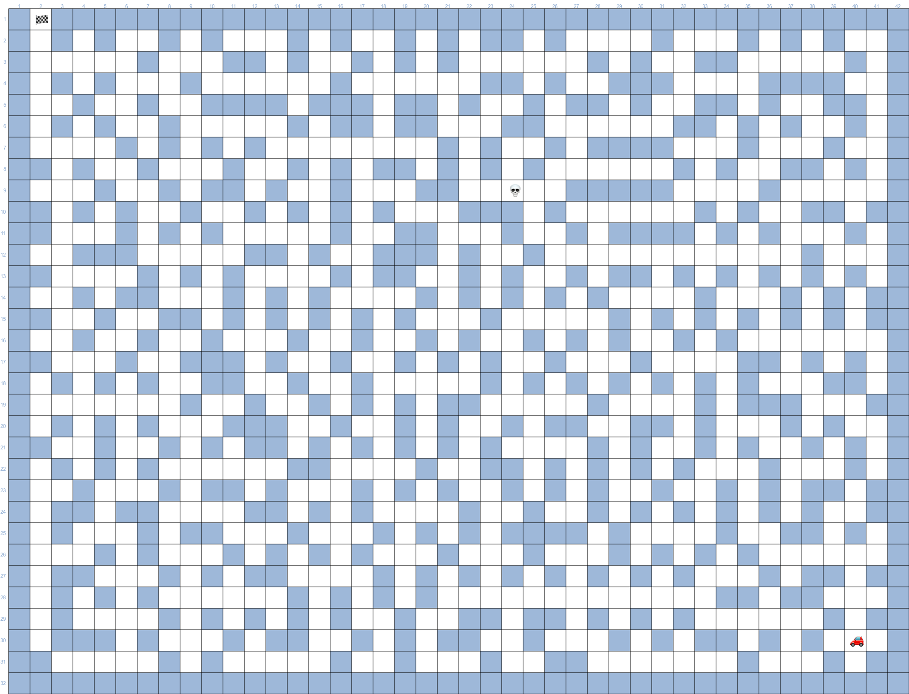

# Basics Redux

In this assignment your goal is always to get the car to the final flag. 
You have three functions (Lego blocks) to achieve this:

- **Move** : Moves the car 1 space in the direction it is heading. 
- **Turn** : Turns the car 90 deg clockwise. 
- **Peek** : Returns true if the next cell is open, otherwise false. 

Of course, you also have the option to use the other blocks that you create based on our syllabus to achieve your goal (variables, conditionals, arrays, loops and functions)

***Example:***  
  
Possible  solution
```csharp
Move();
Move();
Move();
Turn();
Move();
Move();
Turn();
Turn();
Turn();
Move();
```

This is a labor-intensive way of creating the program, possible for small problems like this example, but exhaustive for the tasks ahead. So, dive into the toolbox (variables, conditionals, arrays, loops and functions).

## Evaluation

The score is calculated using the following score key:  

- 25% Does your code solve the task?
- 30% How well do you use programming concepts?
- 15% Readability, how easy is your code to follow?
- 15% Complexity/Verbosity, how complex is your code? 

Additionaly these dimentions are considerd either or: 

- 5% Code conventions, how well does your code follow a code convention?
- 5% Did you use git sensably?  
- 5% Profesionality 

## Submission 

URL to Github repo that contains only the files task1.cs, task2.cs, task3.cs  
We have included a template file that can be used to scaffold these files.  
**We expect to se one commit per file, with meaningfull .**


## Task 1

As stated you can use the functions Move, Turn and Peek + variables, conditionals, arrays, loops and functions to get the car to the end.

**Submit**: add task1.cs *(copy tempale.cs and rename to task1.cs)* to the repo.
Commit to github. 

  

## Task 2

As stated you can use the functions Move, Turn and Peek + variables, conditionals, arrays, loops and functions to get the car to the end.

**Submit**: add task2.cs *(copy tempale.cs and rename to task2.cs)* to the repo.
Commit to github. 

  

## Task 3

As stated you can use the functions Move, Turn and Peek + variables, conditionals, arrays, loops and functions to get the car to the end.

**Submit**: add task3.cs *(copy tempale.cs and rename to task3.cs)* to the repo.
Commit to github. 

 
